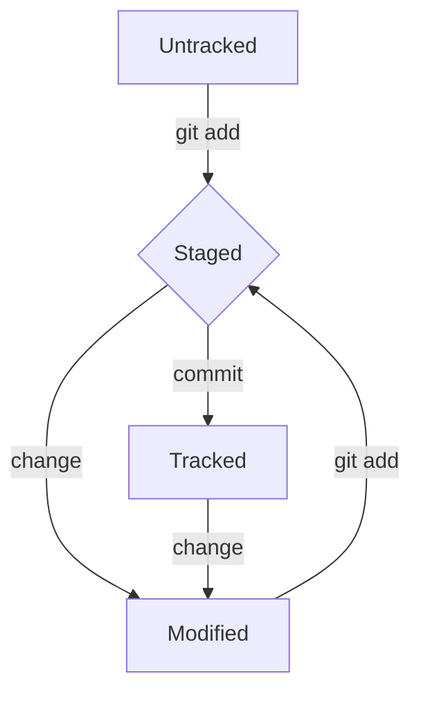

# Что такое Git?

---

## Содержание

* Общие сведения о Git
* Установка и настройка Git
* Работа непосредственно с Git

---


## Немного теории

Git - это система контроля версий, как следует из названия нужная для работы с версиями проекта.

То есть ее использование завязано на истории изменения продукта. Git позволяет **локально** хранить

предыдущие состояния проекта, в том числе помечать что именно было изменено в разные моменты времени.


## Установка и настройка необходимых программ

Для работы с Git его для начала требуется установить.

Данный процесс отличается в зависимости от ОС, дальше будет показан вариант для Linux систем.

В командной строке требуется ввести следующую операцию (в примере использован дистрибутив Ubuntu, для других дистрибутивов 

следует обратиться к инструкции с официального сайта [Git](https://git-scm.com/download/linux "Открыть ссылку")):

```bash
$ apt-get install git
```

Чтобы проверить корректность установки можно воспользоваться следующей комнадой:

```bash
$ git --version
```

Следующим этапом нужно будет настроить базовую среду. Для этого достаточно задать *имя пользователя* 

и *e-mail*:

```bash
$ git config --global user.name "Name Nickname" 
$ git config --global user.email e-mail@something.com
```

Данная информация будет помещена в скрытый файл .gitconfig в домашней директории.

Чтобы получить из него данные достаточно ввести следующую команду:

```bash
$ git config --list
```

На этом подготовительный этап закончен, дальше речь пойдет непосредственно о работе с Git.


## Работа с Git

### Рассматриваемые команды:

* init
* status
* add
* commit

## git init

Логично что для того чтобы начать работать с неким проектом трбеутся задать его отправную точку.

С точки зрения Git ей является репозиторий, то есть папка, содержащая в себе сам проект. В процессе

превращения обычной папки в Git-репозиторий происходит "магия" - появляется начальнвя ветка изменений

проекта, то есть первая линия времени, в рамках которой будут происходить изменения.

Итак, как задать репозиторий? Все просто, для этого требуется перейти в нужную директорию ввести следующую команду:

```bash
$ git init
```

Сразу стоит сказать и о другой важной команде - удаление репозитория. Запускать ее нужно из папки проекта непосредственно:

```bash
$ rm -rf .git
```
В данном случае была использована команда из стандартного языка bash, список базовых [тут](https://practicum.yandex.ru/trainer/git-basics/lesson/fe0bcd71-f592-423b-bb81-27c37a6a115b/ "Перейти")

## git status

Как следует из названия данная команда нужна для проверки состояния репозитория.

```bash
$ git status
```

## git add

Наконец мы дошли до интересного, ранее было определно понятия Git, но как работает данная среда? На самом деле механизм 

заключается в следующем: *каждый раз, когда разработчик вносит изменения в проект, он говорит Git, чтобы тот пометил этот момент,

тем самым создавая две версии продукта - до и после его изменения.*

Но как происходит данное помечание? Оно разбито на 2 этапа, первый из которых заключается в обозначении Git'у, что изменение было сделано.

Данное обозначение реализуется командой **git add**. Важно понимать, что данное действие ничего не сохраняет, оно только добавляет изменение

как существующее в Git.

Отслеживать состояние репозитория как ранее было сказано можно с помощью **git status**. Таким образом использовав эту команду до команды add

и после, можно проследить процесс добавления информации об изменении в Git:

```bash
$ git status
$ git add <файл, в котором произошло изменение>
$ git status
```  

Также можно добавить флаг --all для одновременного обозначения всех изменений:

```bash
$ git add --all
```

## git commit

Ранее оговариволось, что процесс добавления изменения в Git разбит на 2 этапа: объявление, что изменение было и сохранение его. За второй этап

отвечает команда **git commit**. По умолчанию без флагов будет предложенно ввести некоторый клмментарий о том, что именно было измененно в этот раз.

Чтобы не переключаться межну разными приложениями лучше использовать флаг -m, который говорит о том, что дальше последует передаваемое сообщение об изменении:

```bash
$ git commit -m "Сообщение"
```


# Дополнительная информация о Git

---

## Содержание

* Хеш в Git
* Содержание лога
* Статусы файлов

---

## Хеш

Хеш - результат воздействия хеш-функции на некие входные данные. В рамках Git хеш является главным идентификатором для коммита. Благодаря особенностям отпечатка 
(*результата хеш-функции, второе название хэш*), идентификатор коммита получается индивидульным и не поддается колизии.

Для просмотра хэш текущего commit требуется ввести следующую команду:

```bash
$ git log
``` 

Хеш код показывается в первой строчке информации о каждом коммите.

## Содержание лога

В качестве параметров, идущих на выход *git log* мы получаем информацию об автор комиита, комментарии к нему, идентификатору по хэшу, а также дате, когда он был 

сделан. Существует также более короткая версия вывода изменений, которая вызывается командой *git log --oneline*:

```bash
$ git log --online
```

## Статусы файлов

В общем всего есть 4 состояния файла в git: **untracked**,  **tracked**, **staged**, **modified**.

Untracked - начальное состояние новосозданного/добавленного файла, когда git знает о существовании файла, но не следит за его изменением.

Tracked - состояние, когда git следит за тем, какие изменения вносятся в файл.

Staged - состояние готовности, то есть git не только следит, но еще и знает об последних изменениях, внесенных в файл.

Modified - состояние, когда git следит за файлом, видит, что в него были внесены изменения, но не видит, какие именно.

Для перехода из состояния **untracked** в **tracked** надо поместить информацию об ихменении файла, то есть сделать команду *git add*. При  этом так как теперь git будет знать

о последних изменениях файла, он также автоматически получит состояние **staged**.

---

### Staged

Данное состояние имеет несколько названий: **staged**, **indexed**, **cashed**. Связано это с разной терминологией, используемой для понятия пространства, в котором находятся

файлы готовые к коммиту: **staging area**, **index**, **cash**.

---

Также фажно отметить, что состояние **tracked** никак не отображается, так как о его наличии говорит отсуствие состояния **untracked**. То есть после коммита файл все также

остается в **tracked**, поэтому *git status* не выводит ничего. При этом интересно, что возможно одновременно два состояния: **staged** и **untracked**, такое происходит, если

прошлая версия уже была добавлена к готовности, то есть использовано *git add*, после чего было произведено некое изменение, тем самым новая версия файла получила статус 

**modified** и существует параллельно предыдущей **staged**, пока снова не будет выполнена команда *git add*.


### Схематическое изображение состояний файла




## Заключение

На этом основная информация по работе с Git заканчивается, если будет интересно, как добавить к данным знаниям еще и то, как вывести это с уровня "локально", то

перейди к гайду ["Работа с GitHub"](https://github.com/grigioo/github_intoduction.git "Перейти")
   


